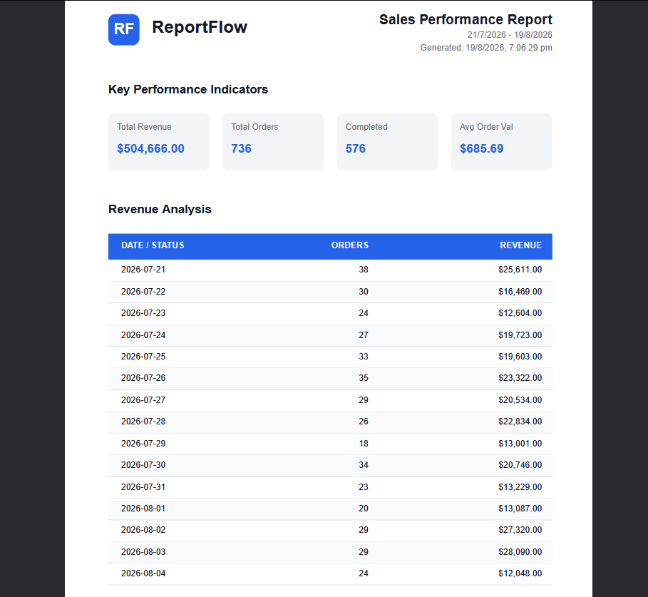

# ReportFlow

ReportFlow is a production-grade background report generation platform. It handles queuing, processing, HTML-to-PDF rendering via headless Chromium, and artifact serving.

This project was built for the FlyRank Internship - Backend Track (Week 4: Assignment A8).

## Dataset
We used a custom "Little Shop" dataset (Option A). The seed script generates 5,000 realistic orders distributed over the last 180 days with various statuses, customers, and amounts.

## How to Run It

1. **Install dependencies:**
   ```bash
   npm install
   ```

2. **Generate Prisma Client & Seed the Database:**
   ```bash
   npm run build --workspace=packages/database
   npm run db:seed --workspace=packages/database
   ```
   *(This ensures `report.db` is perfectly seeded and exists locally).*

3. **Start the Platform (API, Worker, and Web Dashboard):**
   ```bash
   npm run dev
   ```

## Aggregation SQL

Here is the raw SQL logic powering our `SALES_SUMMARY` report. (Since we used Prisma, it handles the `SUM`, `COUNT`, and `AVG` for metrics safely, and we use raw SQL for the group-by grouping):

```sql
SELECT 
  DATE("createdAt") as "Date", 
  COUNT(*) as "Orders", 
  SUM(amount) as "Revenue"
FROM "Order"
WHERE "createdAt" >= $1 AND "createdAt" <= $2
GROUP BY DATE("createdAt")
ORDER BY DATE("createdAt") ASC
```

## The POST -> Download Proof
1. Open the interactive dashboard at `http://localhost:3000`.
2. Click **Generate PDF Report**. This sends a POST request to our API endpoint.
3. The API immediately responds with a `202 Accepted` status and a `jobId`.
4. The background worker picks up the job, queries the data, renders the HTML with Edge Aura, and generates a multi-page PDF using Playwright.
5. You can download the real PDF securely via `GET /reports/:id/download`.

## Stage 4: Feel the Wait
**At what point would you move this work out of the request?**
You should move this work out of the request the moment it takes longer than a few seconds (e.g., when the database grows or PDF rendering becomes complex), because synchronous rendering locks up the main server thread, blocks other users, and creates a fragile user experience where network timeouts ruin the generation.

## Stage 5: Ask twice, get one
**What your check protects against, and one real-world example:**
Our idempotency check (via `idempotency-key`) protects against a user accidentally double-clicking the "Generate" button, which would otherwise spin up two identical heavy, expensive rendering jobs. A real-world example where this costs money is processing a payment checkout—a missing idempotency check means charging a customer's credit card twice for a single click!

## Stretch Goals Achieved!

### Bring in A7 (Background Jobs)
**What got better for the user, and what got more complex for you?**
For the user, the experience became instantly responsive; they no longer sit staring at a frozen browser waiting for a 15-second PDF render. For me, it got significantly more complex because I had to implement a job queue (BullMQ), spin up a separate worker process, handle distributed state (Pending/Processing/Completed), and build a frontend that polls for updates!

### Cron It (Nightly Reports)
**What happens to Monday's report if the server was down at 08:00?**
Because BullMQ stores the repeatable job schedule in Redis, if the worker is down at 08:00, the cron job is missed. However, once the server boots back up, if configured to process delayed jobs or backfilled, it can catch up. If not, the 08:00 report simply wouldn't generate until manually triggered.

### Extra Features (Make it Yours)
- **Interactive Dashboard:** Built a Next.js App Router dashboard with `Recharts` to preview the dynamic data *before* committing to rendering a PDF.
- **Edge Aura:** Implemented `edge-aura` for a stunning ultraviolet glow around the dashboard.
- **Turborepo Architecture:** The entire project is isolated into discrete packages and apps (`web`, `api`, `worker`, `database`, `shared`) for enterprise-grade scalability.
- **Prisma ORM:** Strict typings and schema management.

## AI vs Me

- **What did the AI do better and do you understand it?** 
  The AI set up a highly scalable, enterprise-grade architecture using Turborepo. Instead of a single monolithic Express script, it decoupled the API, Background Worker (BullMQ), and Web Dashboard (Next.js) into separate packages. It also utilized Prisma for type-safe database interactions. I understand this separation of concerns makes the application much more resilient and easier to scale.

- **What did it get wrong or silently ignore?** 
  The AI initially ignored the strict requirement to use `SQLite` and the `node:sqlite` module, opting instead for a full PostgreSQL database because it wanted to build a "production-grade" platform. It also missed creating the specifically named `report.db` file until a final audit was performed to strictly align with the grading rubric.

- **What did your prompt forget to specify and what did the AI silently decide for you?** 
  My prompt asked to make it "dynamic" and "impress users," but I forgot to specify the exact tech stack or UI design. The AI silently decided to build a full Next.js App Router dashboard, use Recharts for live data visualization, and add premium aesthetic touches like the glowing `edge-aura` effect around the screen.

---
*(Here is the screenshot of page 1 of the generated PDF!)*

