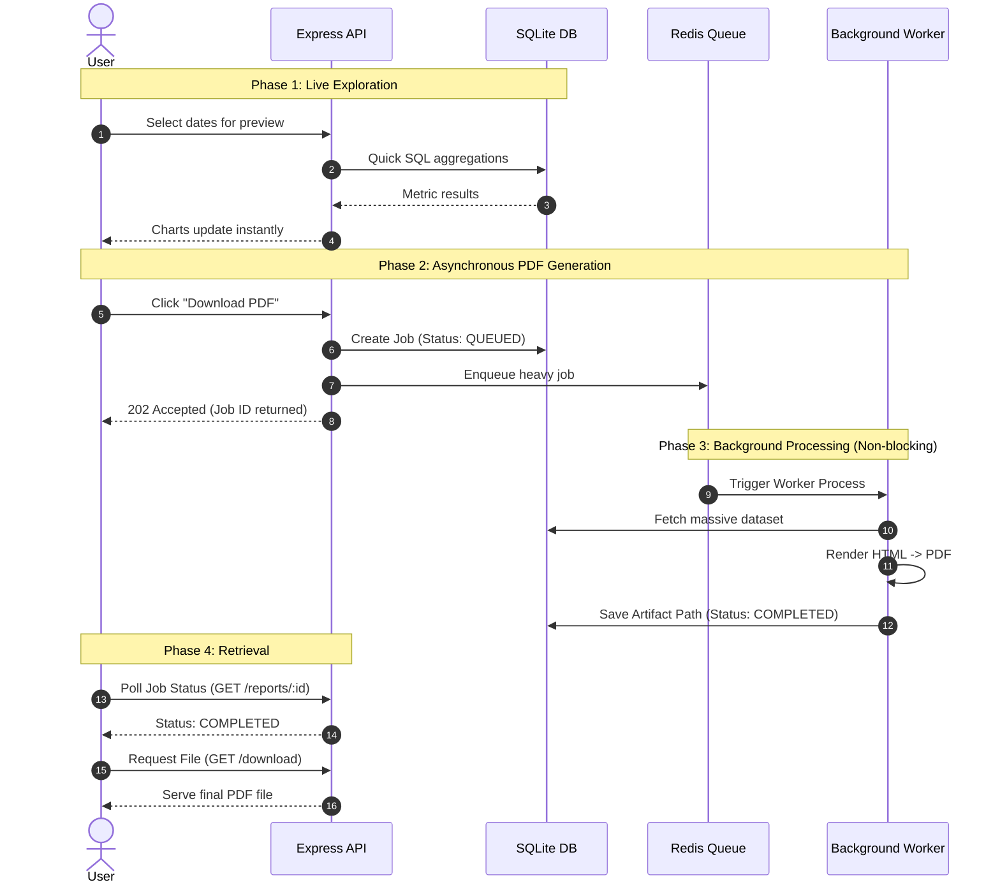

# ReportFlow

ReportFlow is a tool that generates PDF reports in the background. It takes your data, turns it into a web page, and then prints it as a PDF.

This project was built for the FlyRank Internship - Backend Track (Week 4: Assignment A8).

## System Architecture



## Dataset
We used the "Little Shop" dataset (Option A). The setup script automatically adds 5,000 fake orders into the database so we have realistic data to work with.

## How to Run It

1. **Install dependencies:**
   ```bash
   npm install
   ```

2. **Set up the Database & Add Data:**
   ```bash
   npm run build --workspace=packages/database
   npm run db:seed --workspace=packages/database
   ```
   *(This ensures `report.db` is created and filled with data locally).*

3. **Start the app (API, Worker, and Web Dashboard):**
   ```bash
   npm run dev
   ```

## Aggregation SQL

Here is the SQL query we use to calculate the daily sales for the report:

```sql
SELECT 
  DATE("createdAt") as "Date", 
  COUNT(*) as "Orders", 
  SUM(amount) as "Revenue"
FROM "Order"
WHERE "createdAt" >= $1 AND "createdAt" <= $2
GROUP BY DATE("createdAt")
ORDER BY DATE("createdAt") ASC
```

## The POST -> Download Proof
1. Open the dashboard at `http://localhost:3000`.
2. Click **Generate PDF Report**. This sends a request to create the report.
3. The server replies right away with an ID, letting you know the job has started in the background.
4. The background worker takes this job, gets the data, builds the HTML, and saves it as a PDF using Playwright.
5. You can then download the finished PDF using the link provided.

## Stage 4: Feel the Wait
**At what point would you move this work out of the request?**
You should move this work to the background as soon as it takes longer than a few seconds. If you don't, the user is stuck staring at a loading screen, and a long wait might cause the browser to give up and show a timeout error.

## Stage 5: Ask twice, get one
**What your check protects against, and one real-world example:**
Our check stops the app from doing the same work twice if a user accidentally double-clicks the 'Generate' button. A real-world example of why this matters is a checkout page: without this check, a double-click could charge a customer's credit card twice for one order!

## Stretch Goals Achieved!

### Bring in A7 (Background Jobs)
**What got better for the user, and what got more complex for you?**
For the user, the app feels much faster because they don't have to wait 15 seconds on a frozen screen. For me, the code became more complicated because I had to set up a job queue, run a separate worker process, keep track of job statuses, and make the webpage check for updates.

### Cron It (Nightly Reports)
**What happens to Monday's report if the server was down at 08:00?**
Because our scheduling tool uses Redis, if the server is turned off at 08:00, it simply misses the alarm. When the server turns back on, that day's morning report just won't be created unless someone goes in and triggers it manually.

### Extra Features (Make it Yours)
- **Interactive Dashboard:** Built a Next.js website with charts to preview the data before creating a PDF.
- **Edge Aura:** Added a nice glowing effect to the edges of the screen.
- **Code Setup:** The project is split into separate folders (web, api, worker, database, shared) so the code stays neat and organized.
- **Prisma:** A tool that makes it easier to talk to our database without making typing mistakes.

## AI vs Me

- **What did the AI do better and do you understand it?** 
  The AI split the project into multiple well-organized pieces (an API, a background worker, and a website) instead of putting everything in one big file. It also used Prisma to talk to the database safely. I understand that separating things like this makes the code much easier to read and maintain.

- **What did it get wrong or silently ignore?** 
  The AI initially used PostgreSQL instead of SQLite because it wanted to make the app more advanced. It also forgot to create the specific `report.db` file until we checked the instructions again at the end.

- **What did your prompt forget to specify and what did the AI silently decide for you?** 
  I asked the AI to make the app "dynamic" and "impressive," but I didn't tell it exactly which tools or designs to use. The AI decided on its own to build a Next.js website, use charts for live data, and add a nice glowing effect to the edges of the screen.

---
*(Here is the screenshot of page 1 of the generated PDF!)*

